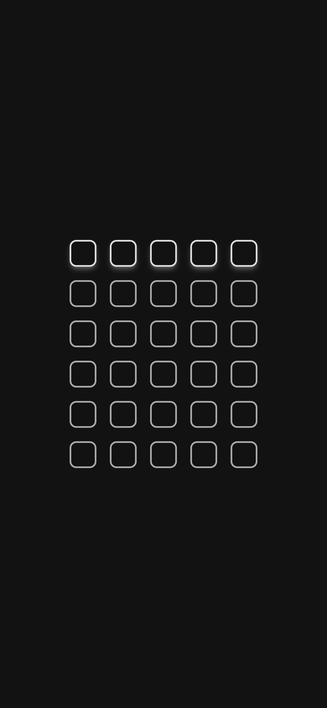
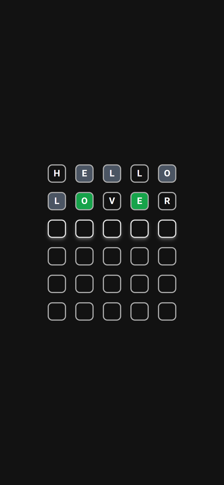
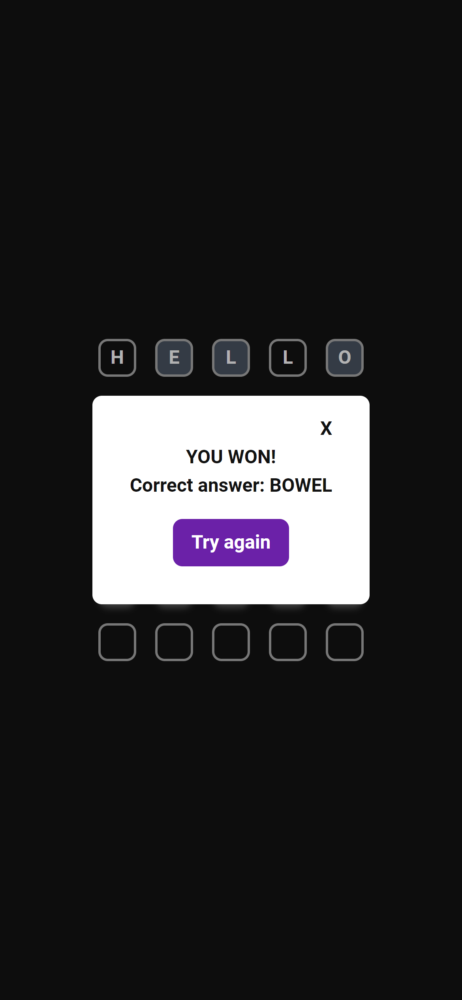
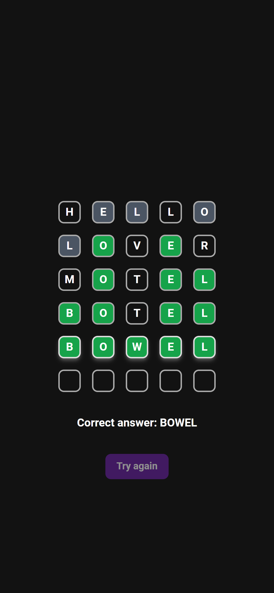

# Wordle game

This is a wordle-inspired game with React and Tailwind based on invisible always-focused input.


## Table of Contents

- [Installation](#installation)
- [Usage](#usage)
- [Credits](#credits)

## Installation

1. Open a terminal and navigate to the root folder.
2. Install the required dependencies by running the following command:

   ```bash
   npm install
   ```

3. Start the development server by running the following command:

   ```bash
   npm start
   ```

## Usage






## Credits

This project utilizes most of all the following libraries, frameworks, and resources:

- [React](https://reactjs.org/): A JavaScript library for building user interfaces.
- [Tailwind CSS](https://tailwindcss.com/): A utility-first CSS framework for rapidly building custom user interfaces.
- [Bill Cruise's dataset on kaggle](https://www.kaggle.com/datasets/bcruise/wordle-valid-words): A dataset with valid wordle guesses and solutions.

Please refer to the documentation or official websites of these resources for more information on how they were used in this project.
